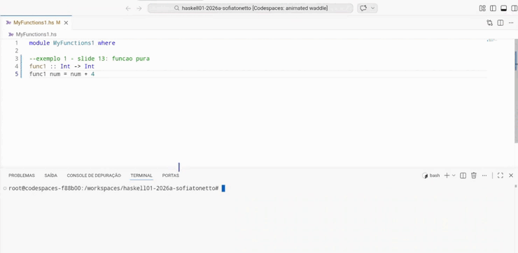

# apresentacao-bim1-2026a-sofiatonetto
apresentacao-bim1-2026a-sofiatonetto created by GitHub Classroom

<b>Efeitos Colaterais:</b>  
   Quando a ação observada vai além do seu "efeito primário" -> ler e/ou retornar um valor, alterando a saída programa sem ser pelo seu retorno.
<u>Exemplos de efeitos colaterais:</u> 
 * O mais comum deles, <u>atribuição de variáveis globais</u>, pois são alteradas fora do escopo.
 * <u>Uso de ponteiros</u>: permitindo que a função altere o valor na memória.
 * <u>Uso de operadores de Incremento ou Decremento</u>: alteram o valor da variável.
   
> "Desvantagem Percebida":
> programas com efeitos colaterais fazem com que o comportamento do código passa a depender da ordem de execução daquele programa, pois o valor de uma variável que está sendo usada pode ser modificado por uma função, por exemplo.

<b>Haskell e os efeitos colaterais:</b>  
Antes de entender isso precisei pesquisar mais sobre funções puras --> são livres de efeitos colaterais. Linguagens puramente funcionais permitem apenas o uso de 'funções puras'.  
Propriedades úteis encontradas:
 * Se o resultado de uma função não é usado, a chamada dessa função é removida, não afetando outras expressões;
 * Processamento paralelo quando não há dependência de dados entre duas ou mais funções puras;
 * A função sempre vai retornar a mesma saída quando receber a mesma entrada;
   
<b>Sobre a relação entre Haskell e os efeitos colaterais:</b>  
Todas suas funções são puras, pois tenta eliminar os efeitos colaterais.  
Porém existe algo chamado <u>"Mônada"</u> --> é uma estrutura algébrica que encapsula ações (como IO (entrada e saída, como ler arquivos e imprimir no terminal), Maybe (usado para computações que podem falhar ou retornos nulos) e List (quando uma função pode retornar múltiplos resultados) ao mesmo tempo que lida com os efeitos colaterais disso de forma pura.

<b>Dados Imutáveis ou Imutabilidade:</b>  
Fundamental para programação funcional, garante que, depois de criados, os valores não podem ser modificados mais. Quando precisa alterar o estado, não deve ser alterado seu valor nunca, mas criado um.
<u>Suas vantagens:</u>
 * Evita efeitos colaterais já que uma vez que seus dados são criados, seus valores não podem ser alterados;
 * Facilita entendimento e debug do código: pelo fato de não permitir mudança nos dados, é mais fácil de entender como os dados são utilizados e onde, facilitando qualquer manutenção necessária.

<b>Exemplos práticos</b>  
<u>Exemplo 1:</u> função 1 --> sem efeitos colaterais.  
  

<u>Exemplo 1:</u> função 3 --> com efeitos colaterais. 
      

<u>Exemplo 1 criado por mim:</u> conversão de moeda    
   
  
<u>Exemplo 2 criado por mim:</u> 

<b>Referências:</b>  
   * [Side Effect (Wikipedia)](https://en-wikipedia-org.translate.goog/wiki/Side_effect_(computer_science)?_x_tr_sl=en&_x_tr_tl=pt&_x_tr_hl=pt&_x_tr_pto=sge#:~:text=Realiza%C3%A7%C3%A3o%20de%20E/S.,MIT%20Press%20.(efeitos%20colaterais))  
   * [Efeitos Colaterais - Leandro Moh](https://leandromoh.gitbooks.io/tcc-paradigmas-de-programacao/content/5_paradigma_funcional/52_efeitos_colaterais.html)  
   * [Funções Puras - Leandro Moh](https://leandromoh.gitbooks.io/tcc-paradigmas-de-programacao/content/5_paradigma_funcional/53_funcoes_puras.html)
   * [Dados Imutaveis](https://www.rocketseat.com.br/blog/artigos/post/introducao-aos-paradigmas-de-programacao)
   * [Dados Imutaveis](https://www.datacamp.com/pt/blog/introduction-to-programming-paradigms)
